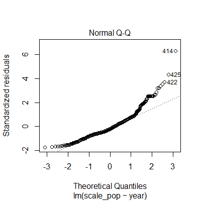

## Introduction to simple statistics in R 

---

<br/>

Statistics can seem and sound both horrifying, and I personally struggled quite a bit with understanding the statistical concepts. So, hopefully this tutorial can help whoever have a difficulty in analyzing large set of data with statistics, also for the beginners as well! 

<br/> 

#### **ACTIVITY**

* UNDERSTAND ... [simple statistic concepts](#simple-stats)
* EXPLORE ... [Living Planet Index data](#explore-lpi)
  + FILTER ... [goose data](#goose-data)   
  + FILTER ... [goose population from Canada and United Kingdom](#filter-ukca)
  + INTERPRET ... [statistical significance between goose population in CA and UK](#stat-sig)
  + PLOT ... [goose population over time for CA and UK](#goose-pop)
* INTERPRET ... [the summary of linearly fitted data](#interpret-data) 
* ANALYZE ... the residuals to validate the regression plot
  + for [UK sample](#residuals-uk)
  + for [CA sample](#residuals-ca)

<br/>

Prior to this tutorial, download the `LPI_data.csv` from [here](https://github.com/EdDataScienceEES/Living_Planet_Data).

<br/>

---

#### 1. <a name="simple-stats"> Simple statistic concepts </a>

<details>

<br/>

This brief slideshow-video introduces some of the fundamental statistical concept as listed below: 

* Data types
* Statistical distribution 
* Statistical tests 
* Hypothesis testing 
* p-value

Being able to clearly distinguish between the **data types** and assigning its most appropriate **statistical distribution** and associating **statistical tests** is vital in conducting a "meaningful" analysis for your research. 

<br/>

Generally, biological research follows a general procedure of: 

1. "Theorizing" the effect: construct a research question, and a hypothesis 
    + A general hypothesis; *i.e.* an effect you are expecting, is referred to as an `alterternative hypothesis`
    + A "boring" hypothesis; *i.e.* no effect/association between the samples, is referred to as a `null hypothesis`
    + You will also decide on the "significance level" or the `alpha-value`, where you decide that the effect/association is notable 

2. Collect data 

3. Analyze data; test the effect on your sample to reject either alternative or null hypothesis 

4. Possible conclusion 

<br/>

<figure class="video_container" align="center">
  <video controls="true" allowfullscreen="true" poster="img/poster.png" width="700">
    <source src="basic_statistics.mp4" type="video/mp4">
  </video>
</figure>

</details>

<br/>

#### 2. <a name="explore-lpi"> a) Explore and edit the LPI data </a>

<details>

<br/>

* Store essential packages: `library()`

```
library(tidyverse)  
library(ggthemes)
library(ggpubr)
```

<br/>

* Load LPI data  

```
LPI_data <- read.csv("data/LPI_birds.csv")
```

<br/>

* Explore data 

```
head(LPI_data)
summary(LPI_data)  
str(LPI_data)
unique(LPI_data$Class)`  # => Aves 
```

<br/>

* Edit data: convert to long-form  

```
LPI_long <- LPI_data %>%   
  pivot_longer(cols = 25:69,   
               names_to = "year",
               values_to = "pop",
               
               # Remove 'X' from year variables 
               names_transform = list(year = readr::parse_number),
               
               # Remove rows with 'NA'
               values_drop_na = TRUE
  ) %>%
  mutate(Genus_species_id = paste(Genus, Species, id, sep = "_")) %>%  
  group_by(Genus_species_id) %>% 
  
  # Calculate number of years the population was monitored 
  mutate(length_year = max(year) - min(year),
  
         # Calculate the scale population for each species
         scale_pop = (pop - min(pop)) / (max(pop) - min(pop))) %>% 
         
  # Remove rows with 'NA'
  drop_na() %>% 
  
  # Retrieve data with more than 5 years of monitoring 
  filter(length_year > 5) %>% 
  ungroup()
```

</details>

<br/>

#### 2. <a name="goose-data"> b) Filter goose data set </a>

<details>

<br/> 

```
goose <- LPI_long %>% 
  filter(Common.Name == "Canada goose",
         Order == "Anseriformes",
         Family == "Anatidae",
         Genus == "Branta",
         Species == "canadensis") %>% 
  ungroup()
```

</details>

<br/>

#### 2. <a name="filter-ukca"> c) Filter goose population from Canada and United Kingdom </a>

<details>

<br/>

```
gooseCAUK <- goose %>%

  # Simplify the data by selecting most essential columns 
  dplyr::select(Country.list, 
         year, 
         scale_pop, 
         id, 
         length_year) %>%
         
  # Filter countries 
  filter(Country.list %in% c("Canada", "United Kingdom")) %>% 
  group_by(id) %>%
  
  # Filter further to retrieve data with more than 15 years of monitoring 
  filter(length_year > 15) %>% 
  ungroup()
```

<br/>

* Compare average scale_pop between Canada and UK

```
summ_gooseCAUK <- gooseCAUK %>% 
  group_by(Country.list) %>% 
  summarise(av_pop = mean(scale_pop)*100)
  # Canada: 23.4
  # UK: 43.6 
```
  
<br/>

> Question: Is there a **statistical significance** between the two average, or is it purely by **chance**?

</details>

<br/>

#### 2. <a name="stat-sig"> d) Interpret statistical significance between goose population in CA and UK </a>

<details>

<br/> 

**Null hypothesis** (`H0`): There is no statistical significance between the two average. 
**Alternative hypothesis** (`H1`): There is a statistical significance between the two average. 

<br/>

* Create a testing dataframe 
```
df1 <- gooseCAUK %>% 
  dplyr::select(Country.list, scale_pop) 

t.test(data = df1, scale_pop*100 ~ Country.list)
```

<figure align="center">
{width=50%}
</figure>

**Welch two sample t-test**

* `p-value` = 0.0006235 < 0.05
* insignificant p-value infers the rejection of null hypothesis 

<br/> 

Hence, there may be an external factor affecting the average scale-population of goose between the two countries; sample size, environmental condition, monitoring method, etc. 

</details>

<br/>

#### 2. <a name="goose-pop"> e) Plot goose population over time in UK and CA </a>

<details>

<br/>

```
gooseCAUK %>% 

  # Change the color according to the population id 
  ggplot(aes(x = year, y = scale_pop, col = id)) +
  geom_point(alpha = 0.3) +
  
  # Plot a best-fit line 
  geom_smooth(method = lm) +
  facet_wrap(~ Country.list) +
  labs(title = "Goose population trend over time",
       x = "\nYear",
       y = "Population scale\n") +
  theme_bw() +
  theme(panel.grid = element_blank(),
        plot.title = element_text(hjust = 0.5),
        axis.text.x = element_text(angle = 45, vjust = 0.5),
        legend.title = element_text(vjust = 0.9),
        legend.position = "bottom")

# Save plot 
ggsave("img/gooseCAUK_plot.png", width = 4, height = 4)
```
<figure align="center">
{width=50%}
</figure>

<br/> 

UK population trend clearly follows the linear regression, whilst goose pop. in Canada seems to be increasing exponentially. 

Let's first delve into the UK population trend! 

</details>

<br/>

#### 3. <a name="interpret-data"> Interpret the summary of linearly fitted model </a>

<details>

<br/>

* Filter data-set to get a separate data for UK and Canada  

```
gooseUK <- gooseCAUK %>% 
  filter(Country.list == "United Kingdom")

gooseCA <- gooseCAUK %>% 
  filter(Country.list == "Canada")
```

<br/> 

* Fit the gooseUK abnd gooseCA into simple linear model 
  + Predictor (i.e., independent variable): year 
  + Response (i.e., dependent variable): scale_pop

```
gooseUK_simp.fit <- lm(data = gooseUK, scale_pop ~ year)  
 
gooseCA_simp.fit <- lm(data = gooseCA, scale_pop ~ year)
```

<br/>

* Obtain the summary of the two fitted linear models

> Summary of fitted linear models for UK samples 

```
summary(gooseUK_simp.fit)

```
<figure align="center">
{width=50%}
</figure>

<br/>

Observation:

* Residual standard error; error of the regression model = 0.0784
* p-value was smaller than 2.2e-16 inferring that it is rather insignificant that there is no correlation between population and year. 

<br/>

> Summary of fitted linear models for CA samples 

```
summary(gooseCA_simp.fit)

```
<figure align="center">
{width=50%}
</figure>

<br/>

Observation:

* Residual standard error: 0.1594 
* p-value; smaller than 2.2e-16 => reject null hypothesis <br/> 
-> There is some form of association between population and year 

<br/> 

Deduction:

* Error for the regression model of Canada's plot was higher than that of UK
* common p-value: both inferring that there **is** association between the scale-pop and year 

</details>

<br/>

#### 4. <a name="residuals-uk"> a) Analyze statistical test of residuals from UK's data </a>

<details>

<br/>

Analyze the residuals to validate the linear model 
*Residuals; differences between "prediction" and "actual" results*

```
plot(gooseUK_simp.fit)
```

<figure align="center">
{width=50%}
</figure>

<br/>

[1] **Residuals 'vs.' Fitted plot**: clearly indicate a non-linear relationship as the residuals are equally spread out near the dotted horizontal line 

<br/>

<figure align="center">
{width=50%}
</figure>

<br/>

[2] **Normal Q-Q plot**: clearly indicate a normally distributed phenomenon as residual points are scattered very closely on the straight line 

<br/>

<figure align="center">
{width=50%}
</figure>

<br/>

[3] **Scale-Location**: test whether residual points have equal variance along the regression line 

* Possibly, due to small sample size (i.e., only one id; data) it is hard to infer from the graph to deduce the homoscedasticity 
* Likely conclusion may be that residuals are well spread above and below the line possibly, indicating the homoscedasticity nature of the residuals 

<br/>

<figure align="center">
{width=50%}
</figure>

<br/>

[4] **Residuals 'vs.' Leverage**: used to find the residual point that is highly influencial to the model

* There is no points that lie on or within the dashed Cook's distance line suggesting that all points are independent of each other 

<br/>

Hence, we can make a possible deduction that the goose data set were suitable for plotting a linear regression model

</details>

<br/>

#### 4. <a name="residuals-ca"> b) Analyze statistical test on residuals of Canada's data </a>

<details>

<br/> 

```
plot(gooseCA_simp.fit)
```

<figure align="center">
{width=50%}
</figure>

<br/>

[1] **Residuals 'vs.' Fitted plot**: clearly indicate a non-linear relationship 
  + However, the plots are closely clustered in particular trend  

<br/>

<figure align="center">
{width=50%}
</figure>

<br/>

[2] **Normal Q-Q plot**: indicate a normally distributed phenomenon toward the middle but shows additional increase and disbands the dashed linear line  

<br/>

<figure align="center">
{width=50%}
</figure>

<br/>

[3] **Scale-Location**: test whether residual points have equal variance along the regression line 

* Likely conclusion may be that residuals are well spread above and below the line possibly, indicating the homoscedasticity nature of the residuals 
* Again, exhibits some particular clustered trend among the points 

<br/>

<figure align="center">
{width=50%}
</figure>

<br/> 

[4] **Residuals 'vs.' Leverage**: used to find the residual point that is highly influencial to the model

* There is no points that lie on or within the dashed Cook's distance line suggesting that all points are independent of each other 

<br/>

Hence, we can make a plausible conclusion that the goose data set were suitable for plotting a pop-year plot to some extent. 

</details>

<br/> 

---

For further remark, the residual analysis for goose population in Canada could have benefitted the use of fitting the plot to an exponential model.  
